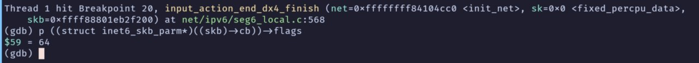
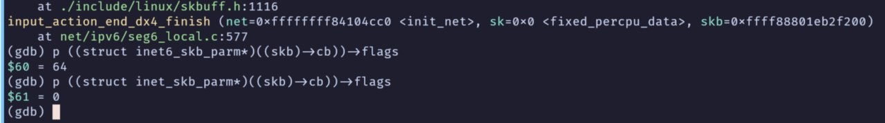

---
categories:
- Linux
date: "2025-11-13"
description: Small bug in Linux when using srv6 end.DX4 under ipsec
title: IPSec tunnel doesn't work in Linux when using srv6 end.DX4
tags:
- Linux
- Bugs
---

## How to reproduce

1. Create a ipsec tunnel between two machines
2. Assign ipv6 address to machines as tunnel ips
3. Configure SRv6 End.DX4
4. Ping each other via srv6 end.dx4

Result: cannot ping each other

## Find root cause

Let's read kernel code and find how pocket flows with ipsec(via xfrm framework) and srv6.


First, we need clarify the code path of target packets. Because we use ipsec tunnel, so every actual payload packet will be packed into a UDP via ESP protocol and the inner packet it's a ipv6 packet with srv6 end.dx4 action which means the structure of entire packet is:

```plain
[  ip header  ]
[ UDP header ]
[ ESP header ]
[ payload ipv6 header ]
[ encaptured ipv4 packet]
```

After the peer node receives ESP packets, it will decrypt this ESP packet and then deliver inner ipv6 packet to network stack. Then the inner ipv6 packet will be handled by the function `input_action_end_dx4`, after that, the actual payload packet(the inner most ipv4 packet) will be passed to `ip_local_deliver`.

If you can debug kernel via gdb, then you will find this ipv4 packet will go into function `xfrm_policy_check` to validate some fields of `skb`. Unfortunately, the life of this ipv4 packet is end there.

After doing some investigation and debugging, I found the problem is that function `input_action_end_dx4` only changes the protocol type and transport layer offset of original skb:

```
static int input_action_end_dx4(struct sk_buff *skb,
				struct seg6_local_lwt *slwt)
{
	if (!decap_and_validate(skb, IPPROTO_IPIP))
		goto drop;

	if (!pskb_may_pull(skb, sizeof(struct iphdr)))
		goto drop;

	skb->protocol = htons(ETH_P_IP);
	skb_set_transport_header(skb, sizeof(struct iphdr));
	nf_reset_ct(skb);

	if (static_branch_unlikely(&nf_hooks_lwtunnel_enabled))
		return NF_HOOK(NFPROTO_IPV4, NF_INET_PRE_ROUTING,
			       dev_net(skb->dev), NULL, skb, skb->dev,
			       NULL, input_action_end_dx4_finish);

	return input_action_end_dx4_finish(dev_net(skb->dev), NULL, skb);
drop:
	kfree_skb(skb);
	return -EINVAL;
}
```

But there is other important field called `cb`(remember the original packet is ipv6, and this field has different format in v4 and v6) of `sk_buffer` remains the original value(in `inet6_skb_param` format):

```
struct sk_buff {
...
	/*
	 * This is the control buffer. It is free to use for every
	 * layer. Please put your private variables there. If you
	 * want to keep them across layers you have to do a skb_clone()
	 * first. This is owned by whoever has the skb queued ATM.
	 */
	char			cb[48] __aligned(8);
...
}
```

After the inner most ipv4 packet passed to `ip_local_deliver`, the `cb` field of original skb will be used as `inet_skb_param`. So, some verifications will failed because they will get a wrong value from `skb->cb`.




