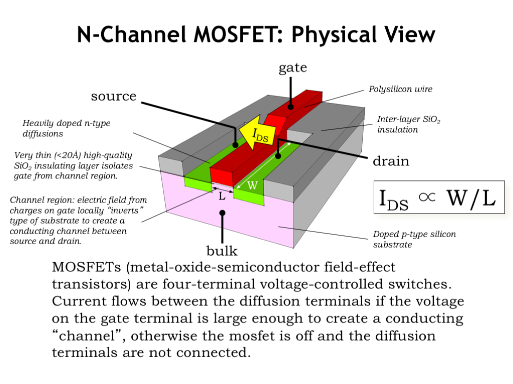
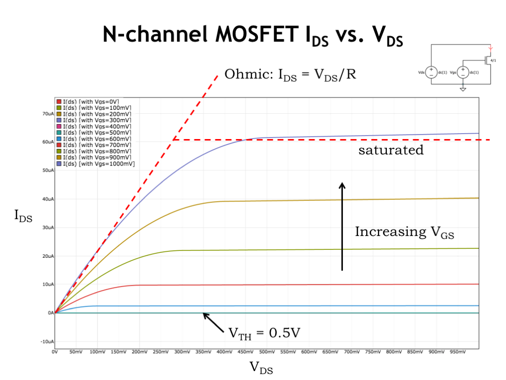
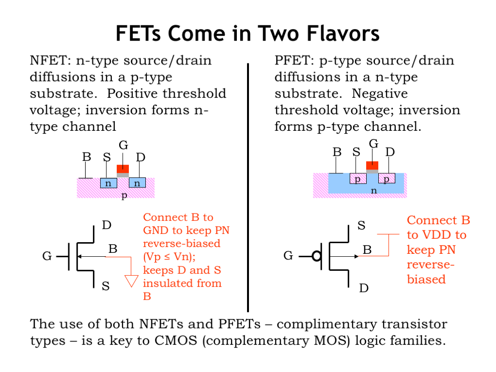
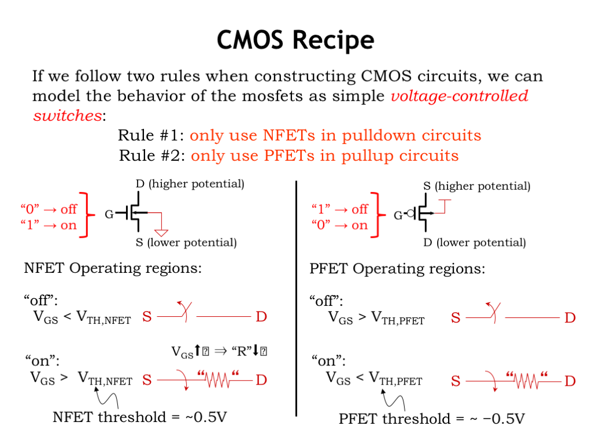
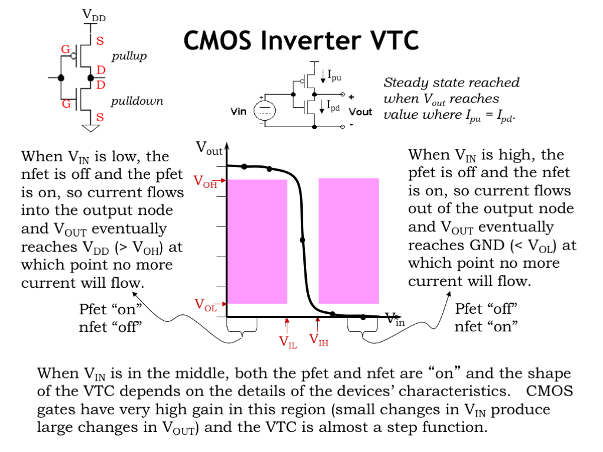
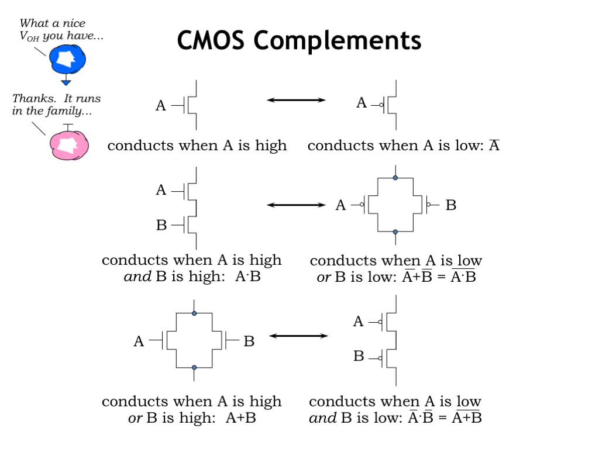
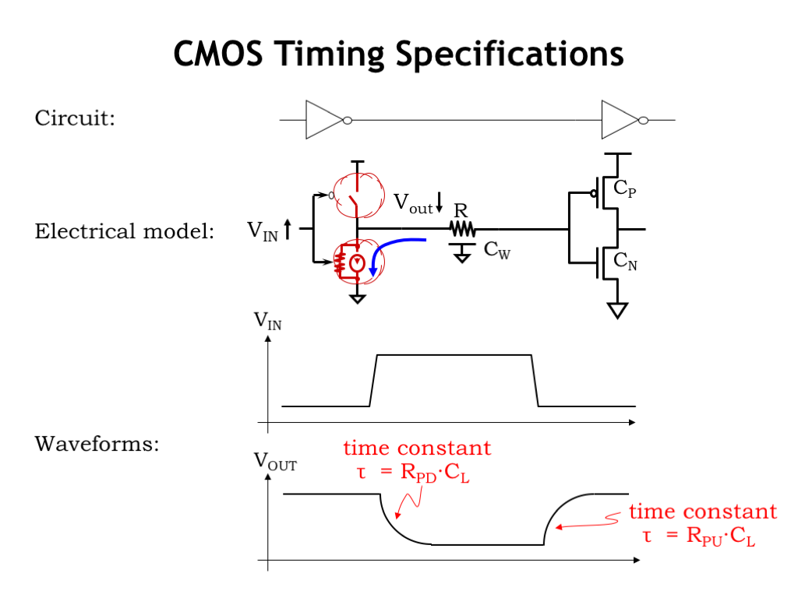
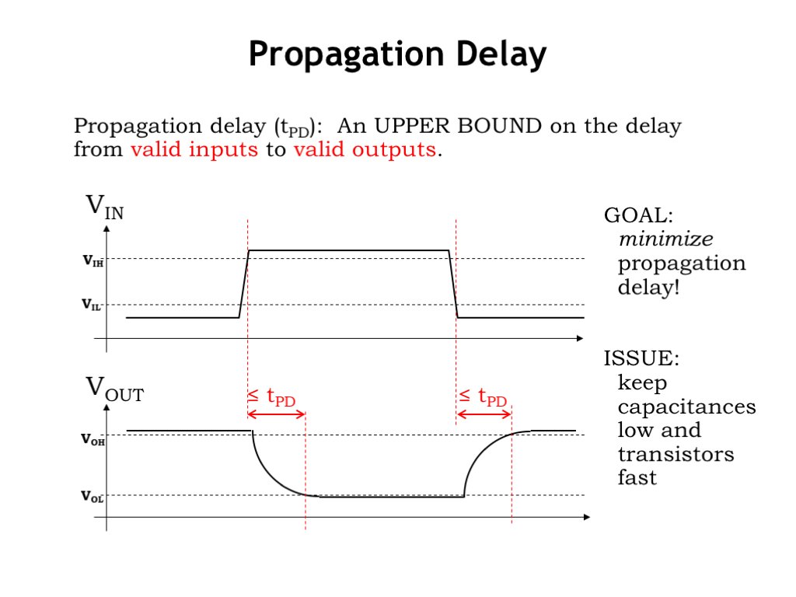
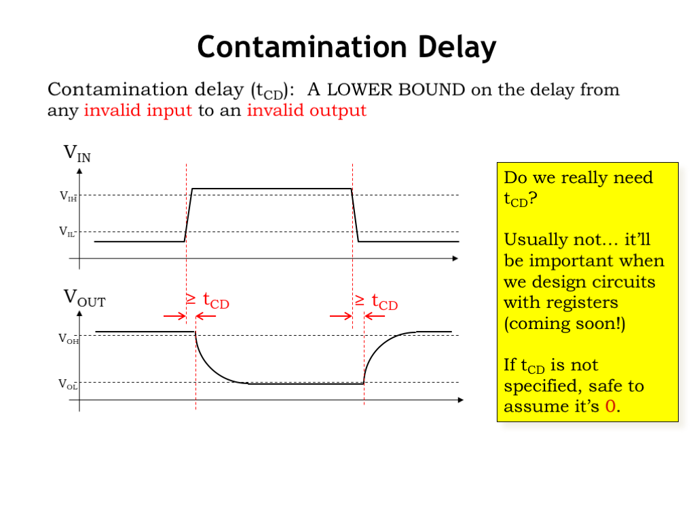
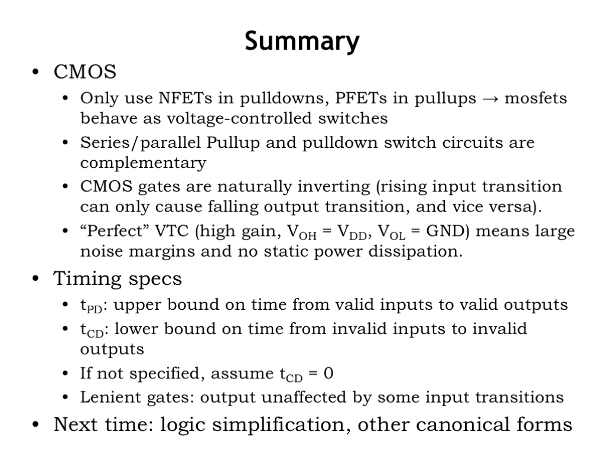

# CMOS

## MOSFET

### Overview

### Characters

### Two Flavors

## CMOS 

CMOS is *Complementary Metal Oxide Semiconductor*

### Two switches

### Inverter

### Basic usage of CMOS

### Timing specifications

#### Propagation Delay

#### Contamination Delay

## Summary

