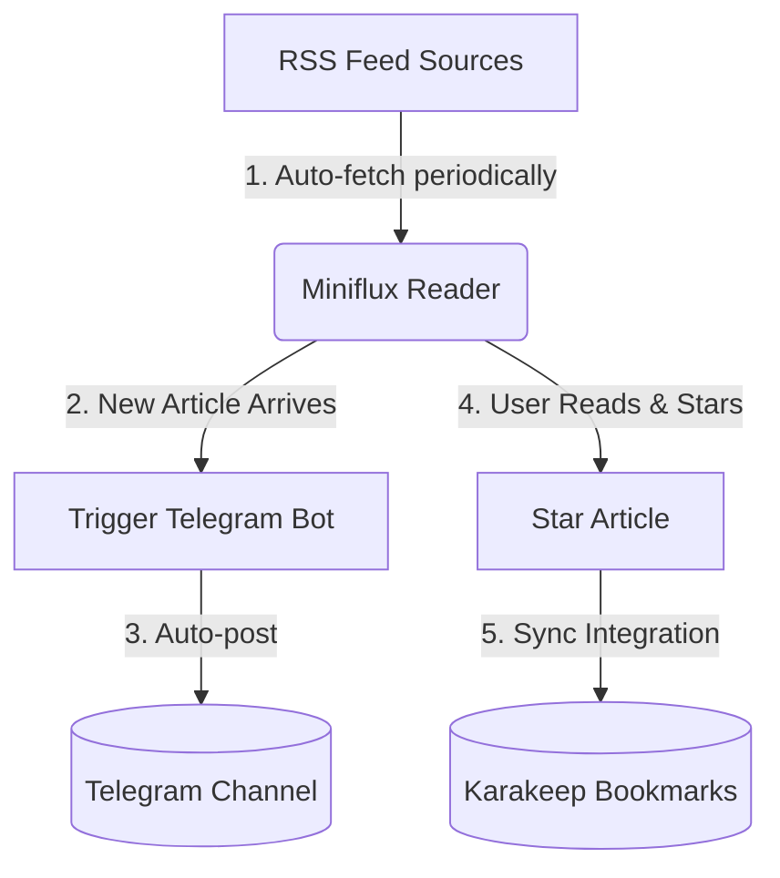

# My RSS Workflow

I use RSS to subscribe to my favorite feeds and reliance on [Karakeep](https://karakeep.app/) for bookmarking. To streamline this, I sync [Miniflux](https://miniflux.app/) with Karakeep so that any saved items in my RSS reader are automatically saved as bookmarks. Additionally, I’ve integrated Miniflux with Telegram to easily share interesting articles with my friends.

