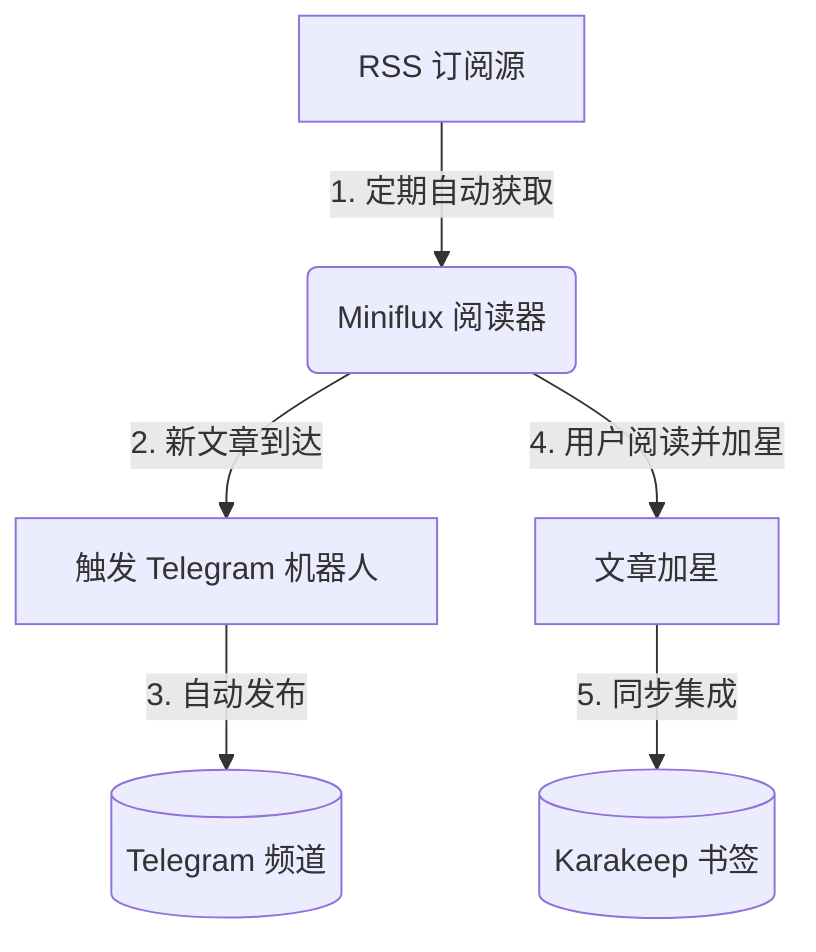

# 我的 RSS 工作流

我使用 RSS 订阅我喜欢的源，并依赖 [Karakeep](https://karakeep.app/) 来管理书签。为了简化这个流程，我将 [Miniflux](https://miniflux.app/) 与 Karakeep 进行了同步集成，这样我在 RSS 阅读器中保存的任何文章都会自动保存为书签。此外，我还将 Miniflux 与 Telegram 进行了集成，以便轻松地与朋友分享文章。

